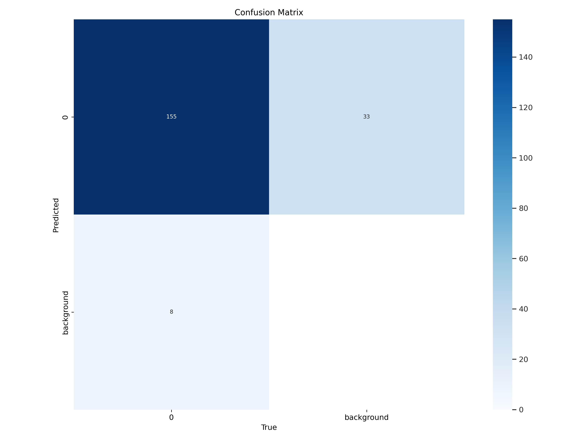
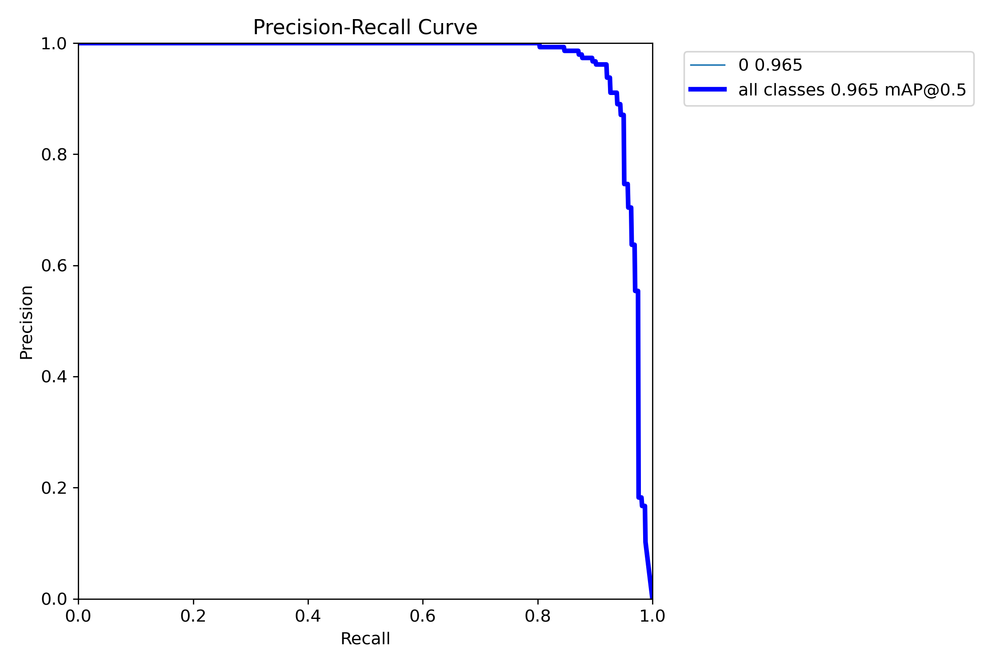

# Plastic Detection in River using Machine Learning

This GitHub repository contains a project that focuses on detecting plastic in rivers using machine learning techniques. The project utilizes the YOLOv8 model for transfer learning to try to achieve accurate and efficient plastic detection.

## Features
* Utilizes YOLOv8 model for plastic detection
* Training code for fine-tuning the YOLOv8 model with custom plastic dataset
* Pre-trained weights for YOLOv8m model with plastic detection capability
* Evaluation code to measure the performance of the model on validation datset
* Inference code for detecting plastic in river images or videos( webcam or from local video)
* Dataset for training and testing the mode

## Requirements

To run the model: 
* Create a virtual environment using: ```python -m venv venv```
* Activate the virtual environment: ```./venv/scripts/activate```
* Install the required packages from requirements.txt: `pip install -r requirements.txt`

#### To run inference, use the `predict.py` file

## Sample

### Input Image:


<br/>

### Predicted Image:


<br/>

## Training Curves and details
#### Training was done in two seperate instances, each of 300 epochs. The details of the second instance is shown below.

### Training curve over 300 epochs:


### Confusion Matrix:
#### '0' stands for the detected plastic


### Precision-Recall Curve:
#### '0' refers to the class 'Plastic'



## Acknowledgements
The project uses the YOLOv8m model uses the following resources:
* [YOLO](https://github.com/ultralytics/ultralytics)
* Initial Dataset provided by REVA University
* Annotaions done using [Make Sense](https://www.makesense.ai/)
* Model prepared using Google Colab

<br/>

#### Note: The provided dataset included 70 images for training. It was then augmented before using for training the model. The ONNX model and the predicted images folders can be accessed from the drve links in the files `model_onnx_link` and `predicted_images` respectively.


